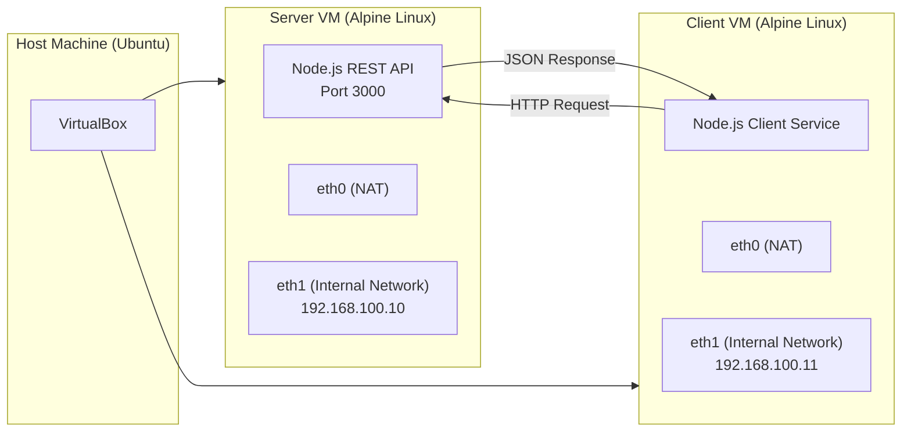

# Microservice Deployment Using Virtual Machines (Alpine Linux)

This repository demonstrates the deployment of a simple microservice-based application across two lightweight virtual machines using **VirtualBox** and **Alpine Linux**. The objective is to understand VM creation, networking, and inter-service communication in a minimal, controlled environment.

---

## 📌 Project Overview

The system consists of two virtual machines:

* **Server VM**: Hosts a Node.js REST API
* **Client VM**: Consumes the API using HTTP requests

Both VMs are connected using a **VirtualBox Internal Network** for service-to-service communication, while **NAT networking** is used only for internet access (package installation).

---

## 🖥️ Virtual Machine Roles

### Server VM

* OS: Alpine Linux
* Role: API Provider
* Service: Node.js REST API (Express)
* Internal IP: `192.168.100.10`
* Port: `3000`

### Client VM

* OS: Alpine Linux
* Role: API Consumer
* Service: Node.js client (Axios)
* Internal IP: `192.168.100.11`

---

## 🏗️ Architecture Design

The following diagram illustrates the connection between the host machine, the two virtual machines, and the communication flow between the microservices.



---

## 🌐 Networking Details

* **eth0 (NAT)**

  * Used for internet access
  * Required for installing Node.js and npm packages

* **eth1 (Internal Network)**

  * Used for VM-to-VM communication
  * No DHCP server available
  * Static IP addresses were manually assigned

This separation ensures that internal microservice communication remains isolated from external networks.

---

## 🚀 Microservice Implementation

### API Service (Server VM)

* Built using **Node.js** and **Express**
* Exposes a single endpoint:

  ```
  GET /api
  ```
* Returns a JSON response
* Binds to `0.0.0.0` to allow access from other VMs

### Client Service (Client VM)

* Built using **Node.js** and **Axios**
* Sends an HTTP request to the server’s internal IP
* Prints the response received from the API

---

## ▶️ How to Run the Services

### On the Server VM

```bash
cd api-service
npm install
node index.js
```

Expected output:

```
API running on port 3000
```

---

### On the Client VM

```bash
cd client-service
npm install
node client.js
```

Expected output:

```
Response from server: { message: 'Hello from Server VM API' }
```

---

## 🧪 Key Challenges Faced

* Network interfaces were initially down and required manual initialization
* Incorrect repository configuration caused package installation failures
* Internal Network did not provide DHCP, requiring static IP configuration
* Alpine booted into live mode until the installer ISO was removed
* API initially bound to `localhost`, preventing external VM access

Each issue was diagnosed using system tools (`ip a`, `udhcpc`, repository checks) and resolved incrementally.

---

## 📂 Repository Structure

```
vm-microservice-alpine/
├── api-service/
│   ├── index.js
│   ├── package.json
│   └── package-lock.json
│
├── client-service/
│   ├── client.js
│   ├── package.json
│   └── package-lock.json
│
├── architecture/
│   └── architecture.mmd
│
└── README.md
```

---

## ✅ Conclusion

This project demonstrates how lightweight virtual machines can be used to deploy and connect microservices without relying on heavy orchestration tools. By resolving real-world setup and networking issues, the assignment provided practical insight into virtualization, networking, and service deployment.
